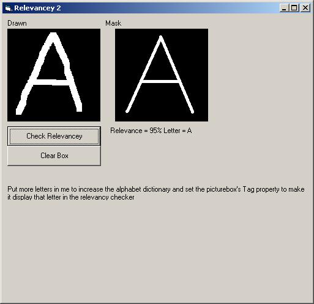



## Patern recognition

### Description

This is a new standard in patern recognition ( Relevancy algorythim ) This program gives you a small 150,150 sized drawing aeria where you can write letters then the program will search ur drawing space and convert it to text (this can be edited and modified to do your homework lol not that i promote that)
 
### More Info
 

             |
---                |---
**Submitted On**   |2005-04-22 01:24:06
**By**             |[Ryan L \(rm200ie\)](https://github.com/Planet-Source-Code/PSCIndex/blob/master/ByAuthor/ryan-l-rm200ie.md)
**Level**          |Advanced
**User Rating**    |4.7 (28 globes from 6 users)
**Compatibility**  |VB 6\.0
**Category**       |[Miscellaneous](https://github.com/Planet-Source-Code/PSCIndex/blob/master/ByCategory/miscellaneous__1-1.md)
**World**          |[Visual Basic](https://github.com/Planet-Source-Code/PSCIndex/blob/master/ByWorld/visual-basic.md)
**Archive File**   |[Patern\_rec1879814222005\.zip](https://github.com/Planet-Source-Code/ryan-l-rm200ie-patern-recognition__1-60147/archive/master.zip)

